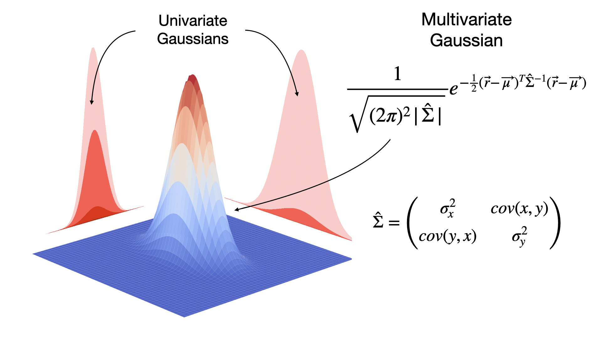

Welcome to my web page!

My name is **BARRY Adama**. I'm a third-year PhD student in Statistics and Optimisation at Institut de Mathématiques de Toulouse (IMT), 
INRIA Grénoble and Institut Francais du Pétrole et des Energies nouvelles (IFPEN). 
I work on **Optimal designs of physical and numerical experiments for Bayesian calibration of expensive computer code**.

On this page, I'll be posting tutorials on the tools I'm using for my thesis in the **Tutorials** section. 

